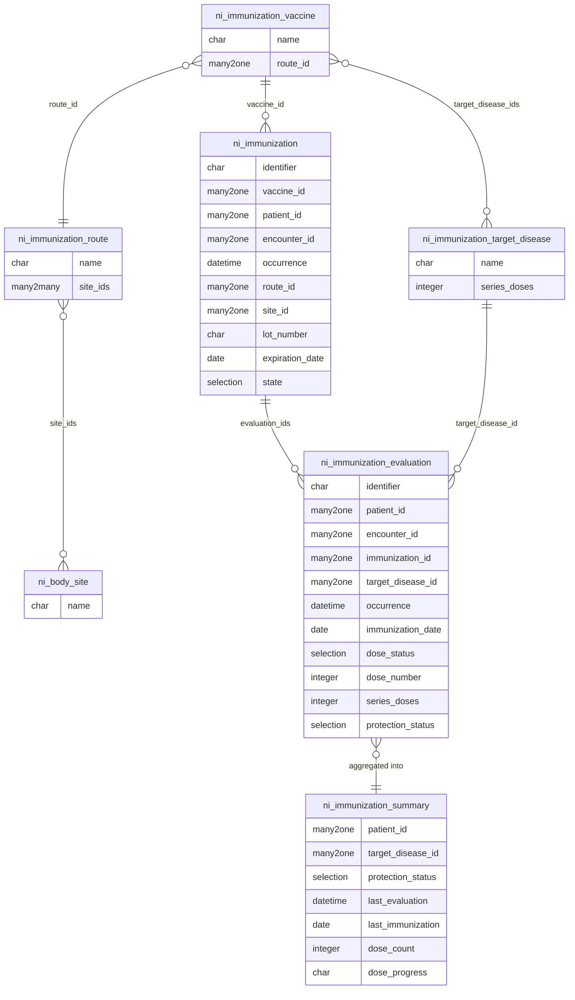

# ni_immunization — Immunization

Tracks vaccine administration and immunization evaluations for patients within the Nirun healthcare platform.

## Clinical Business

### Vaccine Administration

Records each dose given to a patient during an encounter: the vaccine product, occurrence datetime, lot number, expiration date,
dose quantity, administration route, injection site, and the performing clinician. Route options are pre-filtered by the
vaccine's default route; available body sites are filtered by the chosen route.

### Immunization Evaluation

Assesses whether a recorded dose (or a manually entered historical dose) is valid and how it contributes to a patient's
protection against a specific target disease. Each evaluation records:

- **Target disease** — the disease being assessed
- **Immunization date** — when the dose was physically administered
- **Assessment date** (`occurrence`) — when this evaluation was performed
- **Dose status** — valid / not-valid (with optional reason)
- **Dose number / doses required** — position in the series
- **Protection status** — computed as _protected_, _partial_, or _not-protected_

Business rules enforced:

- A vaccine's target diseases constrain which diseases can be evaluated against that dose.
- Only one valid evaluation per `(patient, disease, dose_number)` may exist.
- A single immunization dose cannot be referenced by two evaluations for the same disease.
- An evaluation cannot reference a dose that belongs to a different patient.

### Protection Summary

A read-only SQL view (`ni.immunization.summary`) aggregates evaluations per `(patient, disease)` to expose the current
protection status, last immunization date, and last evaluation date. This drives the summary tab on the patient encounter and
the kanban/tree views in the Immunization menu.

### Batch Evaluation Wizard

A two-step wizard lets clinicians evaluate multiple diseases at once from the encounter form: select diseases (filtered by
protection status), then confirm dose numbers and dates in a single submit.

### Pending Disease Alerts

After recording an immunization, the system computes which of the vaccine's target diseases have not yet been evaluated. These
appear as an inline alert on both the immunization form and the kanban card, with a direct **Evaluate** button.

---

## HL7 FHIR Coverage

| FHIR Resource (R4)                                                                                                                 | Odoo Model                       | Notes                                                                                                    |
| ---------------------------------------------------------------------------------------------------------------------------------- | -------------------------------- | -------------------------------------------------------------------------------------------------------- |
| [`Immunization`](https://hl7.org/fhir/R4/immunization.html)                                                                        | `ni.immunization`                | `vaccineCode`, `occurrence`, `lotNumber`, `expirationDate`, `doseQuantity`, `route`, `site`, `performer` |
| [`Immunization.route`](https://hl7.org/fhir/R4/immunization.html#Immunization.route)                                               | `ni.immunization.route`          | Bound to FHIR `immunization-route` value set                                                             |
| [`ImmunizationEvaluation`](https://hl7.org/fhir/R4/immunizationevaluation.html)                                                    | `ni.immunization.evaluation`     | `targetDisease`, `doseStatus`, `doseStatusReason`, `doseNumber`, `seriesDoses`                           |
| [`ImmunizationEvaluation.targetDisease`](https://hl7.org/fhir/R4/immunizationevaluation.html#ImmunizationEvaluation.targetDisease) | `ni.immunization.target.disease` | Coding with `series_doses` default                                                                       |

---

## Data Model

---

## Module Dependencies

| Module         | Purpose                                                  |
| -------------- | -------------------------------------------------------- |
| `ni_patient`   | `ni.patient`, `ni.encounter`, workflow/identifier mixins |
| `ni_body_site` | `ni.body.site` for injection site selection              |
